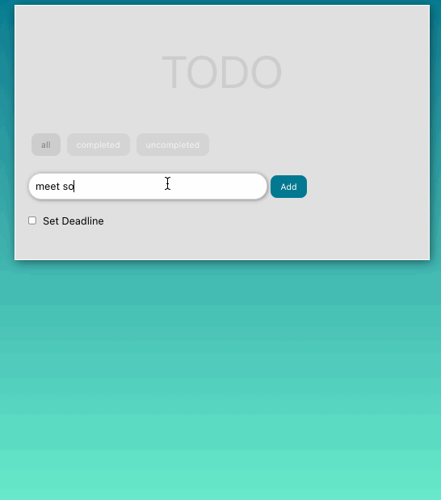

# Todo App

A todo app built with React and Redux.

User can take actions such as adding, removing, editing todo as well as marking as completed/uncompleted and setting a deadline.

## Demo

Use the app online at https://dincengincan.github.io/todo-app-react-redux/

## Technologies Used

- [React](https://reactjs.org/)
- [Redux](https://redux.js.org/)
- Styled Components

## Run Project Locally

Assumes local installation of [Node.js](https://nodejs.org)

To run the project locally:

- Clone this repository `git clone https://github.com/dincengincan/todo-app-challenge.git`
- Run `cd todo-app-challenge.git`
- Run `yarn add`
- Run `yarn start`
